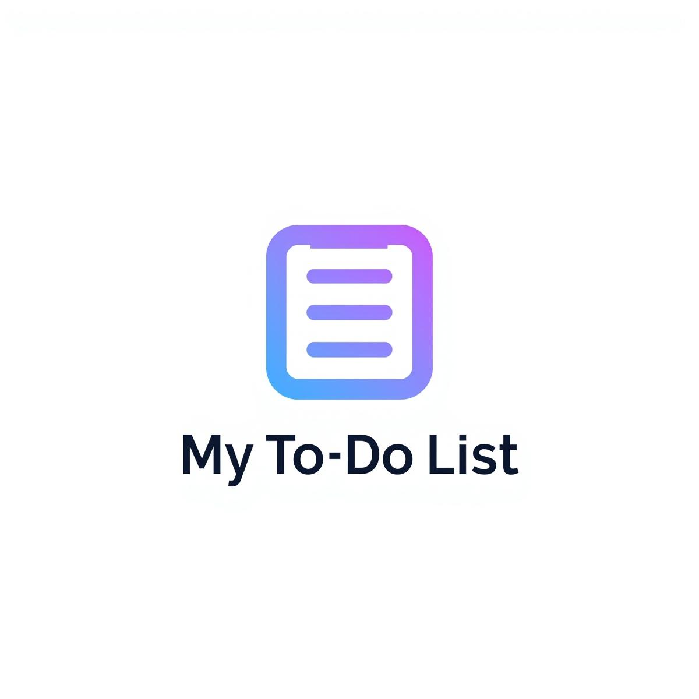

# 🚀 To-Do List Web App


A modern To-Do List Web Application built with core PHP, featuring object-oriented architecture, a clean UI, and robust user authentication.

---

## 📝 Table of Contents

- [About](#about)
- [Features](#features)
- [Screenshots](#screenshots)
- [Project Structure](#project-structure)
- [Installation](#installation)
- [Usage](#usage)
- [Backup & Data](#backup--data)
- [Contributing](#contributing)
- [License](#license)
- [Contact](#contact)

---

## 📚 About

To-Do List Web is an open-source PHP web app to help users manage daily tasks effectively. Built with an OO approach, it demonstrates best practices in routing, database, service classes, repositories, and interfaces for maintainable codebases.

---

## ✨ Features

- Create, read, update, delete (CRUD) tasks
- User authentication: Register & Login
- Responsive design with custom CSS
- Object-Oriented (OO) structure: Service, Repository, Interface, Controller layers
- SQL database: backup and restore
- Screenshot-ready task dashboard
- Organized MVC-style project structure

---

## 📸 Screenshots

  
*Add more screenshots as needed, stored in `Views` folder.*

---

## 🗂️ Project Structure

```
.
├── README.md
├── Views
│   ├── css/
│   ├── html files
│   └── assets (logo.jpg)
├── app
│   ├── Controller/
│   ├── Core/
│   ├── Interface/
│   ├── Repository/
│   └── Service/
├── index.php
├── tasks.txt
├── todo_full_backup.sql
└── vendor/
```

---

## ⚡ Installation

1. **Clone the repo**
   ```
   git clone https://github.com/Code-With-Mavia/To-Do-List-Web.git
   cd To-Do-List-Web
   ```

2. **Install dependencies**
   ```
   composer install
   ```
   *(Requires Composer.)*

3. **Set up the database**
   - Import `todo_full_backup.sql` into MySQL or compatible DB.
   - Configure DB connection in `app/Core/Database.php`.

4. **Start local PHP server**
   ```
   php -S localhost:8000
   ```
   Open [http://localhost:8000](http://localhost:8000) in your browser.

---

## 💡 Usage

- Register or log in to manage tasks.
- Use the dashboard to add, edit, and delete tasks.
- Tasks are stored securely and persist after reload.

---

## 🔄 Backup & Data

- Restore your database using `todo_full_backup.sql`.
- Export or manually back up with `tasks.txt`.

---

## 🤝 Contributing

- Fork the repository
- Create a new branch (`git checkout -b feature/AmazingFeature`)
- Commit your changes (`git commit -m 'Add some AmazingFeature'`)
- Push to the branch (`git push origin feature/AmazingFeature`)
- Open a Pull Request

Suggestions and contributions welcome—please check the issues or submit feature requests.

---

## 📄 License

Distributed under the MIT License. See `LICENSE` for more information.

---

## 👤 Contact

**Maintainer**: Mavia Qaiser  
**GitHub**: [`Code-With-Mavia`](https://github.com/Code-With-Mavia)

---

> _“Built with ❤️ and PHP for everyday productivity.”_

```

You can copy-paste this file as `README.md` in your project root, and further customize the badges or sections as your project evolves.[1][2][4]

[1](https://www.freecodecamp.org/news/how-to-write-a-good-readme-file/)
[2](https://www.makeareadme.com)
[3](https://coding-boot-camp.github.io/full-stack/github/professional-readme-guide/)
[4](https://github.com/othneildrew/Best-README-Template)
[5](https://blogs.incyclesoftware.com/readme-files-for-internal-projects)
[6](https://www.surajon.dev/awesome-readme-examples-for-writing-better-readmes)
[7](https://www.reddit.com/r/learnprogramming/comments/vxfku6/how_to_write_a_readme/)
[8](https://www.youtube.com/watch?v=rCt9DatF63I)